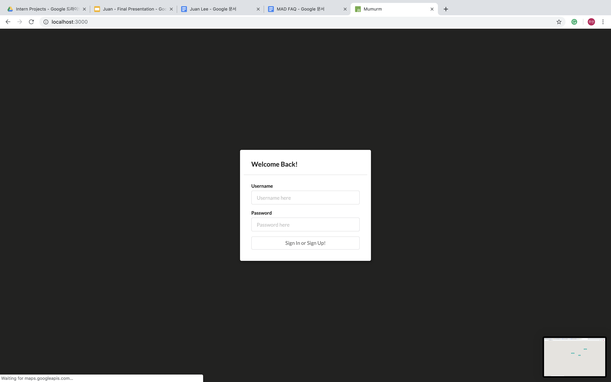
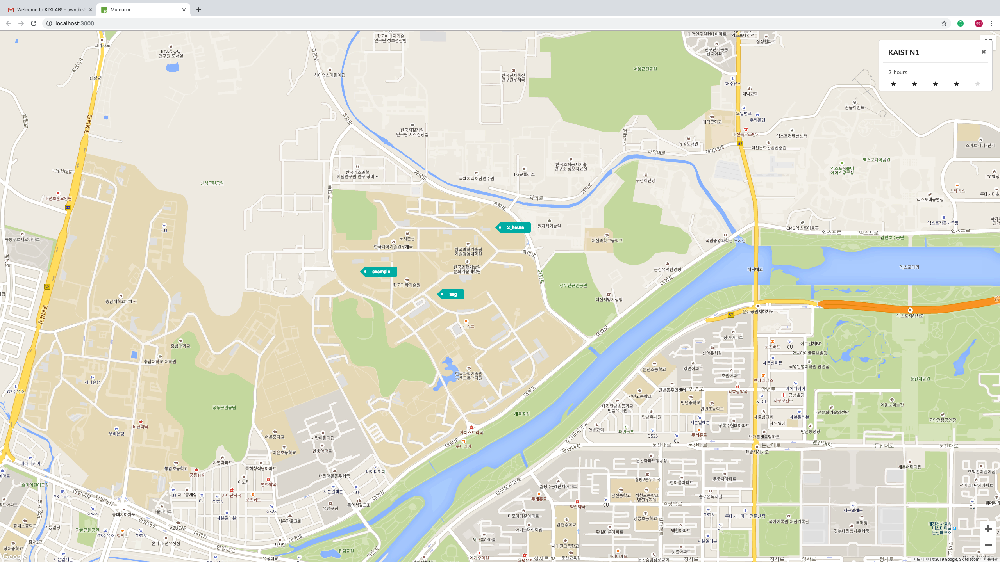
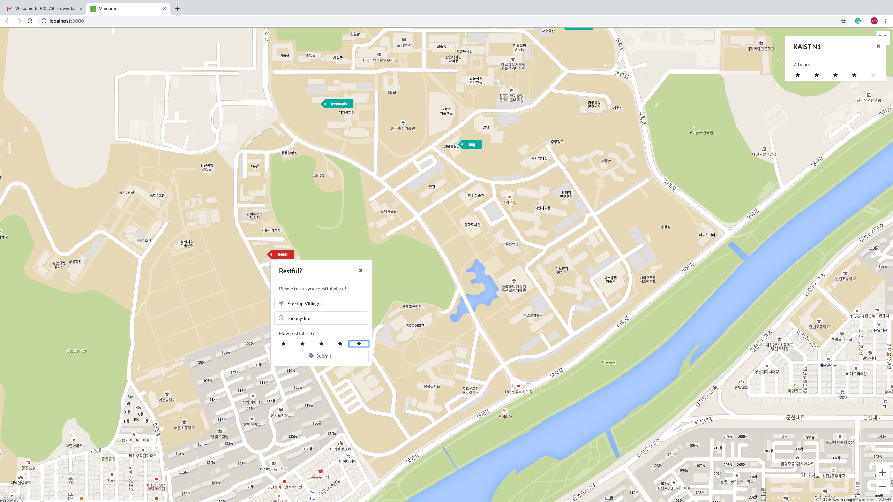

# Mumurm [머묾]
**Find a resting place for a while**

## Why Mumurm?
Everyone knows their own healing places. It can be anything; dormitory, playground, cafe, or possibly his/her secret place. What if we crowdsource those healing places and share them? We thought we could make happier life.

## We provide three Core Functions:
* Google Map
  * allows us to easily find my own healing place
* Easy Input your healing place
  * easy and kind interface let you freely enter your healing place
  * also, you can rate -- will recommend from those rating info
* Show other's healing place
  * you can see where, how long, and how much restful it is!

## Now, introduce Mumurm
If you want to see our digital prototype, just [click me!](https://www.figma.com/file/Y9Zp5VLlVfWGdVBzAdWF5fJe/Mumurm?node-id=0%3A1)  
You can see our prototype here: https://mumurm.netlify.com/

### When you enter the site, you need to **Sign In**!

> We provide very easy and direct sign in & sign up system.  
> Use *jsonstore.io* as remove DB  
> Communicate with *HTTP Request*

### Welcome to Mumurm, you can **See** others
Please click any tag that you want to see. You may see where, how long, and how much restful it is! (On the top right)

> used *[Google Map API](https://cloud.google.com/maps-platform/?hl=ko)* to show and interact with the map  

### Oh, you wanna add your own place?
Then click anywhere you want, and add it!

> fast-prototype with *[Semantic UI React](https://react.semantic-ui.com/)*

## How users think?
This is users' feedback
1. Crowdsource good restaurant near school using this!
2. Please merge tags when zooming out
3. What about suggesting restful place based on rates?
4. Comments or Feedback for enrolled places
5. You may guess user's personality based the rating info?

Thank you all!

## Limitation & Future Works
* Fix the time-input format
* Merge tags when zomming out! *(from feedback)*
* Comments and Feedback for enrolled places! *(from feedback)*
* Ranking System! Be the best MUMURMer
* Suggest restful place for users! *(from feedback)*

## Contributors
* [Juan Lee](https://github.com/sleepy-juan) made basic template with Google Map, Semantic UI
* [Hyunchang Oh](https://github.com/HyunchangOh) added the rating system!